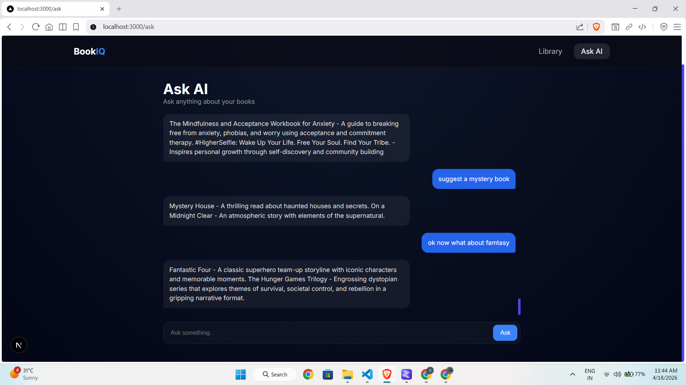
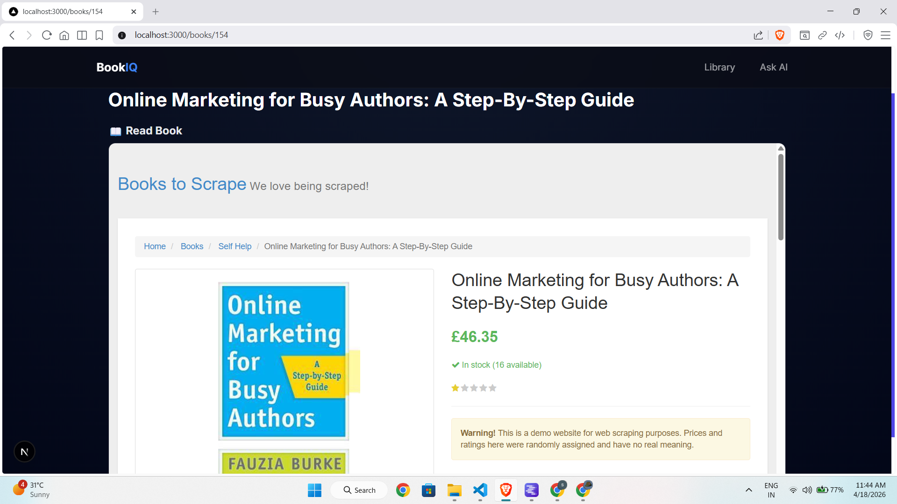

# BookIQ — AI-Powered Book Intelligence Platform

> A full-stack web application that scrapes books, generates AI insights, and enables intelligent Q&A using a RAG pipeline.

---

## Screenshots

(./images/Home page.png)


---

## Tech Stack

| Layer | Technology |
|-------|-----------|
| Backend | Django REST Framework (Python) |
| Database | MySQL (metadata) + ChromaDB (vectors) |
| Frontend | Next.js 15 + Tailwind CSS |
| AI/LLM | LM Studio (local) — Mistral 7B |
| Embeddings | Sentence Transformers (all-MiniLM-L6-v2) |
| Scraping | Selenium |

---

## Setup Instructions

### Prerequisites
- Python 3.10+
- Node.js 18+
- MySQL running locally
- LM Studio installed with a model loaded (e.g. Mistral-7B)
- Chrome + ChromeDriver installed

### 1. Clone the repo
```bash
git clone https://github.com/YOUR_USERNAME/book-intelligence.git
cd book-intelligence
```

### 2. Backend setup
```bash
cd backend
python -m venv venv
venv\Scripts\activate        # Windows
# source venv/bin/activate   # Mac/Linux

pip install -r requirements.txt
```

Create a `.env` file in `/backend`:
```
DB_NAME=bookiq
DB_USER=root
DB_PASSWORD=yourpassword
DB_HOST=localhost
DB_PORT=3306
```

Create MySQL database:
```sql
CREATE DATABASE bookiq;
```

Run migrations:
```bash
python manage.py makemigrations
python manage.py migrate
python manage.py runserver
```

### 3. Scrape books
Make sure Django is running, then:
```bash
cd scraper
python scrape_books.py        # scrapes ~100 books
python generate_insights.py   # generates AI summaries + genres
python index_books.py         # indexes books into ChromaDB
```

### 4. Frontend setup
```bash
cd frontend
npm install
npm run dev
```

Open **http://localhost:3000**

### 5. LM Studio
1. Download from https://lmstudio.ai/
2. Search and download `Mistral-7B-Instruct`
3. Go to Local Server → Start Server
4. Server runs at `http://localhost:1234`

---

## API Documentation

### Books

| Method | Endpoint | Description |
|--------|----------|-------------|
| GET | `/api/books/` | List all books |
| GET | `/api/books/<id>/` | Get book detail |
| GET | `/api/books/<id>/recommendations/` | Get related books |
| POST | `/api/books/upload/` | Upload/scrape a book |

**POST /api/books/upload/** — Request body:
```json
{
  "title": "Sapiens",
  "author": "Yuval Noah Harari",
  "rating": "Five",
  "description": "A brief history of humankind...",
  "book_url": "https://books.toscrape.com/..."
}
```

### Q&A (RAG)

| Method | Endpoint | Description |
|--------|----------|-------------|
| POST | `/api/books/ask/` | Ask a question using RAG |
| GET | `/api/books/history/` | Get chat history |

**POST /api/books/ask/** — Request body:
```json
{
  "question": "Recommend a good mystery book"
}
```

**Response:**
```json
{
  "answer": "Based on your library, I recommend Sharp Objects...",
  "sources": [
    { "title": "Sharp Objects", "author": "Unknown", "genre": "Mystery" }
  ]
}
```


### Core
- Web scraping with Selenium from books.toscrape.com
- Django REST API with full CRUD
- AI-generated summaries and genre classification via LM Studio
- Full RAG pipeline: embeddings → vector search → LLM answer with citations
- React/Next.js frontend with search, filter, and chat interface
- Chat history saved to database

### Bonus
- Response caching (skips re-generating AI insights if already present)
- Overlapping chunk strategy for better RAG context
- Genre-based book recommendations
- Animated loading states
- Chat history persistence

---

## Project Structure

```
book-intelligence/
├── backend/
│   ├── books/
│   │   ├── models.py         # Book + ChatHistory models
│   │   ├── views.py          # REST API views
│   │   ├── serializers.py    # DRF serializers
│   │   ├── urls.py           # API routes
│   │   ├── ai_insights.py    # Summary + genre generation
│   │   └── rag.py            # RAG pipeline
│   ├── backend/
│   │   └── settings.py
│   └── manage.py
├── scraper/
│   ├── scrape_books.py       # Selenium scraper
│   ├── generate_insights.py  # Batch AI insight generation
│   └── index_books.py        # ChromaDB indexing
├── frontend/
│   └── app/
│       ├── page.jsx          # Dashboard
│       ├── ask/page.jsx      # Q&A interface
│       ├── books/[id]/       # Book detail
│       └── components/
├── requirements.txt
└── README.md
```

---

## Submission

Submitted for Ergosphere Solutions internship assignment.

